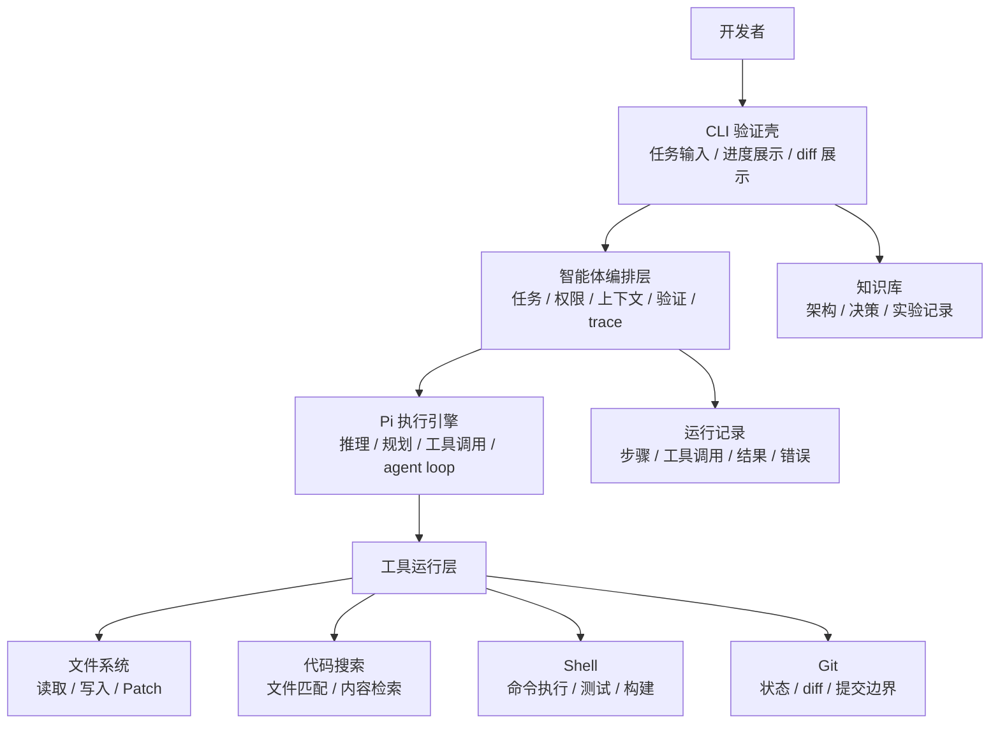
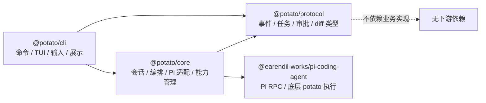
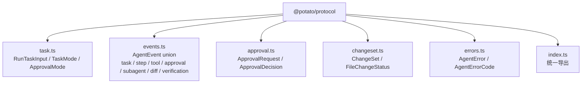
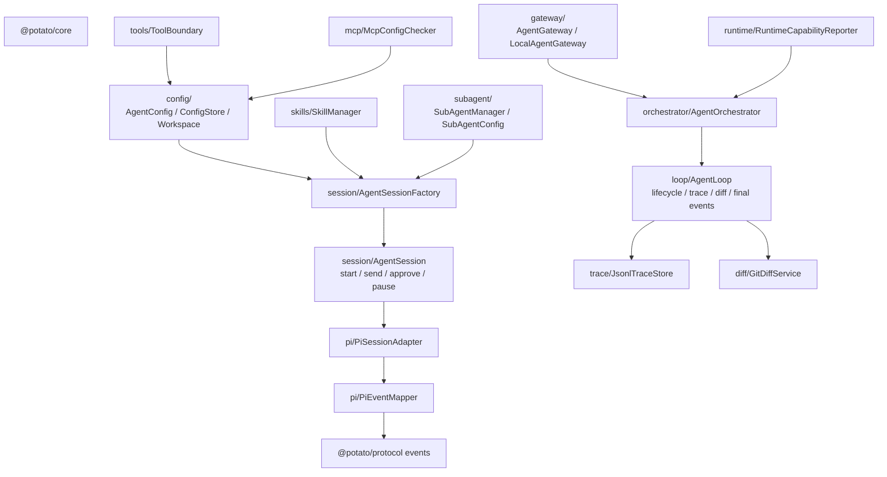
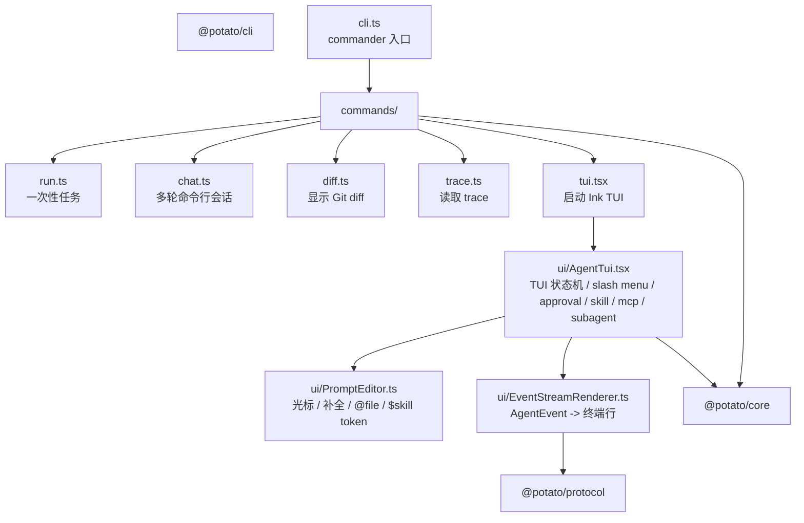
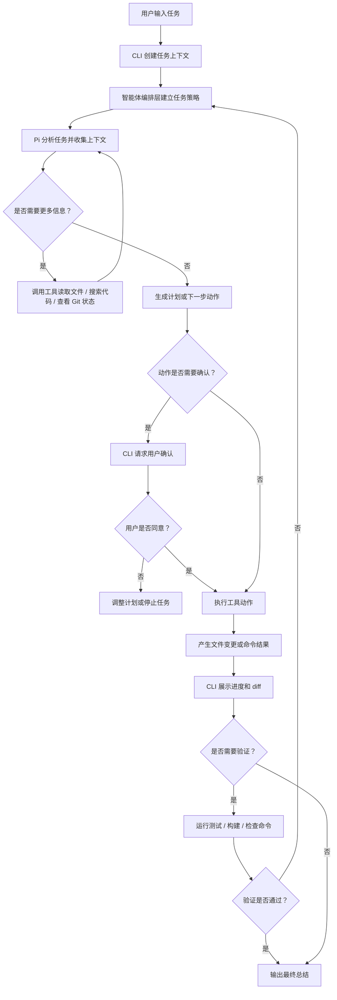

# 架构设计

## 当前方向

构建一个面向开发者的编码智能体产品。第一阶段不优先做桌面 UI，而是先通过 CLI 验证核心工作流。

产品需要先证明自己能完成这些事情：

- 接收开发者任务。
- 使用 Pi 作为底层智能体执行引擎。
- 检查并理解本地代码仓库。
- 在智能体工作时展示当前进展。
- 应用或提出代码变更。
- 清晰展示文件差异。
- 必要时运行验证命令。
- 汇报变更内容和仍不确定的事项。

## 核心决策

直接使用 Pi 作为底层智能体执行引擎，但不把产品能力全部塞进 Pi。

本项目自己的核心能力放在智能体编排层。它位于 CLI 和 Pi 之间，负责任务生命周期、权限、上下文策略、验证策略、diff 策略和运行记录。

第一阶段宿主 UI 使用 CLI。CLI 不需要精致界面，只需要让智能体循环可观察：

- 当前步骤
- 正在执行的工具或动作
- 关键命令输出
- 涉及的文件
- 差异预览
- 最终总结

## 工程约定

项目文档和用户可见文本默认使用中文。后续如果需要英文，可以作为可配置的国际化能力加入。

## 总体架构

```text
CLI
  面向用户的第一阶段验证壳。
  负责启动任务、展示进度、展示 diff、请求确认。

智能体编排层
  本项目自己的产品能力层。
  负责任务生命周期、上下文策略、权限策略、验证策略、diff 策略和 trace。

Pi 执行引擎
  底层智能体执行引擎。
  负责推理、规划、工具调用和 agent loop。

工具运行层
  暴露给智能体的本地能力。
  包括文件读写、搜索、补丁、Shell、Git diff 和测试命令。

知识库
  存放在 wiki 目录中。
  记录决策、实验、架构笔记和实现计划。
```



## 包级架构

当前代码采用 pnpm workspace，分为三个可独立理解的包：

```text
protocol/  @potato/protocol
  稳定协议层，只放类型契约。

core/      @potato/core
  Agent 产品能力层，包含配置、会话、编排、Pi 适配、trace、diff、skill、MCP、SubAgent 和权限边界。

cli/       @potato/cli
  用户入口层，包含 commander 命令、Ink TUI、输入框、菜单和终端事件渲染。
```

依赖方向必须保持单向：



约束：

- `protocol` 不能依赖 `core` 或 `cli`。
- `core` 不能依赖 `cli`。
- `cli` 可以依赖 `core` 和 `protocol`，但不直接接管 Pi 细节。
- Pi 相关实现收敛在 `core/src/pi/`，CLI 只通过 `AgentSessionFactory`、`AgentSession` 或命令 API 使用。

## protocol 独立架构

`protocol` 是跨层契约包，目标是稳定、轻量、无副作用。它定义“系统里发生什么”，不定义“怎么执行”。



边界：

- 只包含 TypeScript 类型和稳定事件结构。
- 不读取文件、不启动进程、不访问 Git、不包含 UI。
- `core` 和 `cli` 都可以使用这些类型，保证事件流和命令输出有共同语言。

## core 独立架构

`core` 是本项目的 Agent 产品能力层。它把 Pi 的底层执行能力包装成可观测、可配置、可扩展的 Coding Agent 会话。



主要职责：

- `config/`：模型、workspace、工具权限、skills、MCP、SubAgent 等运行配置。
- `session/`：长期会话抽象，负责 start/send/stop/approval/pause。
- `pi/`：Pi RPC 适配和原始事件映射，隔离第三方执行引擎。
- `loop/` 和 `orchestrator/`：统一任务生命周期，围绕 adapter 事件补齐 trace、diff、最终状态。
- `trace/`：JSONL 任务审计记录。
- `diff/`：Git 工作区变更检测和 patch 读取。
- `skills/`：内置和外部 skill 的发现、安装、启用/禁用。
- `subagent/`：单 SubAgent 选择和配置合并。
- `mcp/`：MCP 配置检测。
- `tools/`：工具权限边界抽象。

## cli 独立架构

`cli` 是用户交互层。它不拥有 Agent 决策逻辑，只负责把用户输入转成 core 调用，并把 core/protocol 事件展示出来。



主要职责：

- `cli.ts`：定义 `potato`、`potato run`、`potato chat`、`potato diff`、`potato trace`。
- `commands/`：命令模式的薄封装，负责参数解析后的业务调用。
- `ui/AgentTui.tsx`：交互式 TUI 状态机，处理 `/mode`、`/skill`、`/mcp`、`/agent`、审批、暂停、diff 展示。
- `ui/PromptEditor.ts`：输入框编辑模型，支持光标、补全检测、`@file`、`$skill`。
- `ui/EventStreamRenderer.ts`：把 protocol 事件转成终端可读文本。

CLI 不应该直接：

- 解析 Pi 原始事件。
- 决定 potato 编排策略。
- 直接读取或修改 core 的持久化结构。
- 绕过 core 去实现权限、trace、diff、skills 或 SubAgent 逻辑。

## 任务执行流程



## 近期验证目标

第一个实用里程碑是 CLI 能够针对一个本地仓库运行任务，并展示：

```text
收到任务
收集上下文
计划或下一步动作
工具 / 动作进度
文件差异
验证结果
最终总结
```

CLI 只是验证壳。长期产品可以再加入桌面端宿主，但不替换核心模型。
