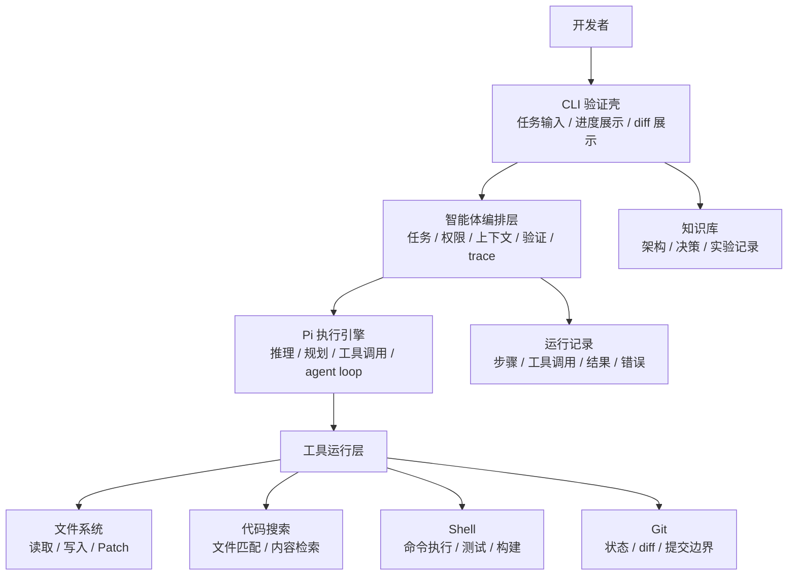
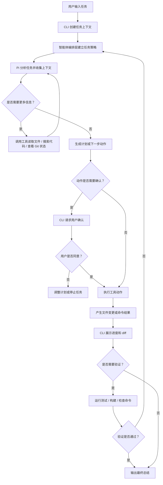

# 架构设计

## 当前方向

构建一个面向开发者的编码智能体产品。第一阶段不优先做桌面 UI，而是先通过 CLI 验证核心工作流。

产品需要先证明自己能完成这些事情：

- 接收开发者任务。
- 使用 Pi 作为底层智能体执行引擎。
- 检查并理解本地代码仓库。
- 在智能体工作时展示当前进展。
- 应用或提出代码变更。
- 清晰展示文件差异。
- 必要时运行验证命令。
- 汇报变更内容和仍不确定的事项。

## 核心决策

直接使用 Pi 作为底层智能体执行引擎，但不把产品能力全部塞进 Pi。

本项目自己的核心能力放在智能体编排层。它位于 CLI 和 Pi 之间，负责任务生命周期、权限、上下文策略、验证策略、diff 策略和运行记录。

第一阶段宿主 UI 使用 CLI。CLI 不需要精致界面，只需要让智能体循环可观察：

- 当前步骤
- 正在执行的工具或动作
- 关键命令输出
- 涉及的文件
- 差异预览
- 最终总结

## 工程约定

项目文档和用户可见文本默认使用中文。后续如果需要英文，可以作为可配置的国际化能力加入。

## 总体架构

```text
CLI
  面向用户的第一阶段验证壳。
  负责启动任务、展示进度、展示 diff、请求确认。

智能体编排层
  本项目自己的产品能力层。
  负责任务生命周期、上下文策略、权限策略、验证策略、diff 策略和 trace。

Pi 执行引擎
  底层智能体执行引擎。
  负责推理、规划、工具调用和 agent loop。

工具运行层
  暴露给智能体的本地能力。
  包括文件读写、搜索、补丁、Shell、Git diff 和测试命令。

知识库
  存放在 wiki 目录中。
  记录决策、实验、架构笔记和实现计划。
```



## 任务执行流程



## 近期验证目标

第一个实用里程碑是 CLI 能够针对一个本地仓库运行任务，并展示：

```text
收到任务
收集上下文
计划或下一步动作
工具 / 动作进度
文件差异
验证结果
最终总结
```

CLI 只是验证壳。长期产品可以再加入桌面端宿主，但不替换核心模型。
