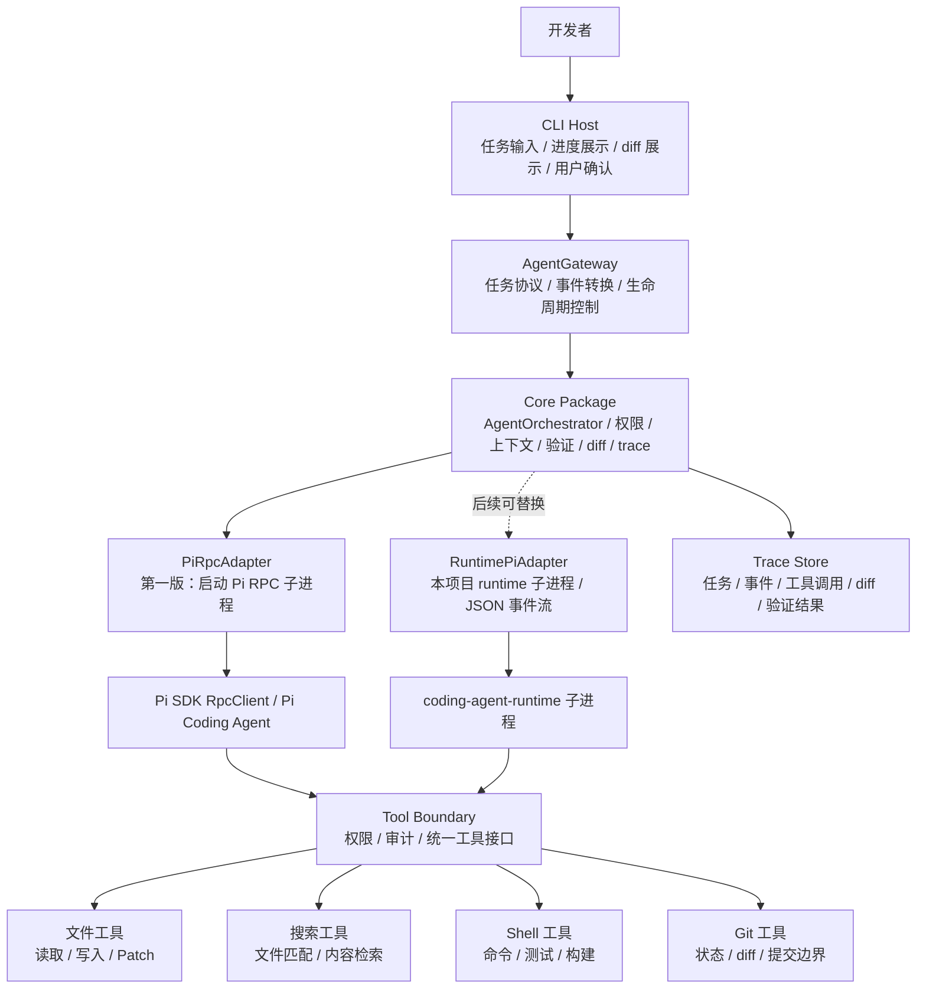
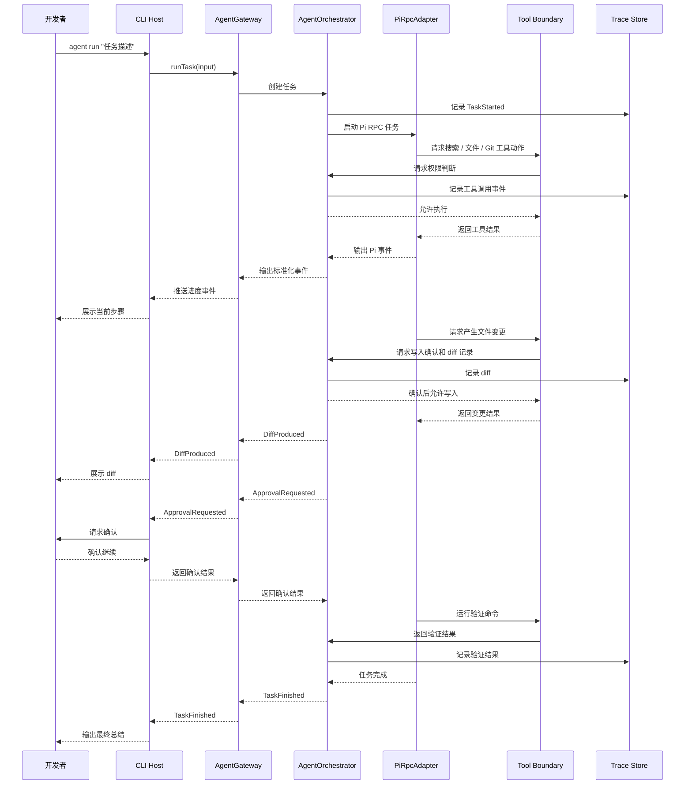

# 技术设计

## 设计目标

第一阶段先做一个可实战验证的 CLI 编码智能体，不做桌面端。CLI 只承担宿主和展示职责，Pi 负责底层 agent loop，本项目自己的产品能力沉在智能体编排层。

第一版需要验证：

- 能在本地仓库中接收任务。
- 能通过智能体编排层调用 Pi 完成任务循环。
- 能把智能体进展转换成用户可理解的事件。
- 能展示涉及文件和 diff。
- 能在关键动作前请求确认。
- 能记录一次任务的运行轨迹，便于复盘和调试。

## 核心判断

采用“Pi RPC 优先，协议边界先行”的方案。

第一版通过 `@earendil-works/pi-coding-agent` 的 `RpcClient` 启动 Pi RPC 子进程。与此同时，在 CLI 和 Pi 之间引入 `AgentGateway`、`AgentOrchestrator` 和 `PiAdapter`。

`AgentGateway` 是宿主入口，面向 CLI 和后续桌面端。`AgentOrchestrator` 是本项目自己的产品能力层，负责任务生命周期、上下文策略、权限策略、验证策略、diff 策略和 trace。`PiAdapter` 负责把我们的任务、工具和策略翻译给 Pi，并把 Pi 的输出转换成我们的事件模型。

CLI 不直接依赖 Pi 的内部事件和对象结构，而是依赖我们自己的任务协议。

后续如果需要把 Pi runtime 拆成独立仓库，只需要增加本项目自己的 runtime gateway。CLI、`AgentGateway` 和大部分编排逻辑不需要重写。

## 工作区边界

`protocol/` 不是核心实现层，它只定义稳定契约。核心能力不应该放进 protocol，否则 CLI、桌面端和 runtime 会被迫依赖一个带实现的“协议包”，边界会变混乱。

当前工作区边界：

| 目录 | 包名 | 职责 | 不放什么 |
| --- | --- | --- | --- |
| `protocol/` | `@coding-agent/protocol` | 任务输入、事件、审批、diff、错误码等类型契约 | Pi 调用、事件映射实现、终端渲染、工具执行 |
| `core/` | `@coding-agent/core` | `AgentGateway`、`AgentOrchestrator`、`PiAdapter`、事件映射、权限、trace、验证、工具边界 | CLI 参数解析、终端 UI |
| `cli/` | `@coding-agent/cli` | 命令解析、交互输入、终端渲染、调用 core | 智能体编排策略、Pi 事件语义转换 |
| `wiki/` | 无 | 知识库和阶段记录 | 运行时代码 |

`AgentOrchestrator`、`PiEventMapper` 和 `PiRpcAdapter` 已从 CLI 拆入 `core/`。后续如果需要更强隔离，再从 `core/` 拆出独立 `coding-agent-runtime` 子进程。

## 能力放置原则

Pi 是底层执行引擎，不是产品能力的唯一承载点。后续要在 Pi 上面叠加能力时，优先放在 `AgentOrchestrator`。

| 能力类型 | 放置层级 | 原因 |
| --- | --- | --- |
| 命令解析、终端展示、用户输入 | CLI Host | 只和当前宿主形态有关 |
| 对外任务接口、事件流入口 | AgentGateway | 保持 CLI、桌面端和未来宿主的统一入口 |
| 任务生命周期、模式、权限、上下文、验证、diff、trace | AgentOrchestrator | 这是本项目自己的长期产品能力 |
| Pi RPC 启动、Pi 事件转换、Pi 工具注册 | PiAdapter | 隔离 Pi 的具体 API 和运行形态 |
| 推理、规划、工具调用循环 | Pi | 复用 Pi 的底层 agent 能力 |
| 文件、Git、Shell、搜索等本地访问 | Tool Boundary | 统一权限、审计和错误处理 |

判断规则：如果一个能力换掉 Pi 后仍然应该存在，就不要放进 Pi 适配器里，而应该放进 `AgentOrchestrator` 或更上层。

## 总体结构



## 模块职责

### CLI Host

CLI 是第一阶段的产品验证壳。它不实现智能体逻辑，只负责：

- 解析命令参数。
- 选择工作目录。
- 发起任务。
- 展示进度事件。
- 展示 diff。
- 处理用户确认。
- 输出最终总结。

CLI 面向的是开发者，所以第一版优先支持少量高频命令：

```text
agent run "<任务描述>"
agent chat
agent diff
agent trace
```

`agent run` 用于一次性任务验证。`agent chat` 用于保持同一个 Pi RPC 会话，在终端里做多轮输入，适合验证“前一轮上下文是否能延续到后一轮”。

### AgentGateway

`AgentGateway` 是我们自己的宿主入口。它隔离 CLI、桌面端和内部实现，避免上层直接绑定 Pi 的具体 API。

它负责：

- 创建任务。
- 启动任务执行。
- 输出标准化事件流。
- 暴露确认请求。
- 暴露任务取消能力。
- 汇总最终结果。

第一版建议接口形态：

```ts
interface AgentGateway {
  runTask(input: RunTaskInput): AsyncIterable<AgentEvent>;
  cancelTask(taskId: string): Promise<void>;
}
```

### AgentOrchestrator

`AgentOrchestrator` 是本项目自己的核心产品能力层。它位于 `AgentGateway` 和 `PiAdapter` 之间。

它负责：

- 管理任务生命周期：创建、运行、取消、失败、完成。
- 选择任务模式：第一版只有 `run`，后续可扩展 `ask`、`plan`、`review`、`fix-test`。
- 管理上下文策略：工作目录、显式文件、搜索结果、Git 状态、上下文压缩。
- 管理权限策略：决定工具动作是否需要确认。
- 管理 diff 策略：何时生成 diff、何时展示 diff、何时允许继续执行。
- 管理验证策略：何时运行验证命令、失败后是否继续尝试。
- 管理预算策略：最大轮次、最大工具调用次数、命令超时。
- 写入 trace：任务、步骤、工具调用、确认请求、diff、验证结果。
- 整理最终结果：变更摘要、验证结论、风险和未完成事项。

这层是我们在 Pi 之上“套能力”的主要位置。Pi 可以替换，CLI 可以替换，但这层沉淀的是项目自己的产品模型和工程策略。

### PiRpcAdapter

`PiRpcAdapter` 是第一版实际 Pi 适配器。它通过 Pi SDK 的 `RpcClient` 启动 Pi RPC 子进程，并把 Pi 的事件、工具调用和结果转换成 `AgentEvent`。

它负责：

- 解析 Pi CLI 入口。
- 启动 Pi RPC 子进程。
- 使用 `core/` 中的模型配置解析结果传入 provider、model 和供应商 API Key。
- 注册工具。
- 注入任务上下文。
- 转换 Pi 事件。
- 捕获错误。
- 把最终结果返回给 `AgentOrchestrator`。

Pi 事件转换由独立的 `PiEventMapper` 承担。这样一次性 `run` 和多轮 `chat` 可以复用同一套事件映射规则，避免不同入口展示的信息不一致。

当前映射规则：

| Pi 事件 | 本项目事件 | 说明 |
| --- | --- | --- |
| `agent_start` | `step.started` | Pi 开始处理任务 |
| `turn_start` | `step.started` | Pi 开始新一轮推理 |
| `message_update` | `assistant.delta` | 提取 assistant text 和 thinking 增量 |
| `tool_execution_start` | `tool.started` | 提取 `args` 生成工具摘要 |
| `tool_execution_end` | `tool.finished` | 提取结果摘要和成功状态 |

工具摘要优先展示开发者关心的细节，例如 `read` 的文件路径、`bash` 的命令、`grep` 的搜索词。拿不到结构化参数时才退回通用摘要。

CLI 展示由 `EventStreamRenderer` 负责。它不是协议层能力，只是终端渲染策略：

- 连续 `assistant.delta` 不逐 token 打印。
- thinking delta 累积到下一个结构性事件前输出为一行 `推理：...`。
- text delta 累积到下一个结构性事件前按正常段落输出。
- 工具结果输出压缩成单行摘要，避免长 JSON、文件内容和命令输出污染会话结构。
- `run` 和 `chat` 共用同一个 renderer，保证一次性任务和多轮会话展示一致。

### RuntimePiAdapter

`RuntimePiAdapter` 不在第一版实现，但协议要为它留出空间。

未来它可以通过本地子进程运行 Pi runtime：

```text
CLI Host
  -> AgentGateway
  -> AgentOrchestrator
  -> RuntimePiAdapter
  -> coding-agent-runtime 子进程
  -> JSON event stream / RPC
```

这条路线适合桌面端、多任务隔离、runtime 重启和长期后台任务。

### Tool Boundary

工具边界是安全和可观测性的核心。Pi 不应该直接无限制访问本地能力，而是通过我们注册的工具进入本地系统。

第一版工具包括：

- 文件读取
- 文件写入或 patch
- 代码搜索
- Shell 命令
- Git 状态
- Git diff
- 验证命令

每个工具调用都要产生事件，写入 trace，并根据权限策略判断是否需要确认。

### Trace Store

Trace Store 记录一次任务的完整过程。第一版可以先用文件落盘，不急于引入数据库。

建议结构：

```text
.coding-agent/
  traces/
    <task-id>.jsonl
```

每一行是一个事件，便于流式写入和后续分析。

## 核心数据模型

### RunTaskInput

```ts
type RunTaskInput = {
  taskId: string;
  workspacePath: string;
  prompt: string;
  mode: "run";
  approvalMode: "manual" | "auto-readonly";
};
```

### AgentEvent

```ts
type AgentEvent =
  | TaskStartedEvent
  | StepStartedEvent
  | ToolCallStartedEvent
  | ToolCallFinishedEvent
  | AssistantMessageDeltaEvent
  | ApprovalRequestedEvent
  | DiffProducedEvent
  | VerificationStartedEvent
  | VerificationFinishedEvent
  | TaskFinishedEvent
  | TaskFailedEvent;
```

事件模型要稳定。即使后续 Pi 的内部事件变了，CLI 也应该尽量不受影响。

`AssistantMessageDeltaEvent` 用于流式展示模型输出：

```ts
type AssistantMessageDeltaEvent = {
  type: "assistant.delta";
  taskId: string;
  channel: "text" | "thinking";
  text: string;
};
```

注意：thinking 内容是否能展示，取决于底层模型和 Pi RPC 事件是否实际提供 thinking content。本项目只负责不丢弃已经进入 Pi RPC 事件流的内容。

### ChangeSet

```ts
type ChangeSet = {
  files: Array<{
    path: string;
    status: "added" | "modified" | "deleted" | "renamed";
    diff?: string;
  }>;
};
```

`ChangeSet` 是 CLI 展示 diff、用户确认和最终总结的核心对象。

## 任务执行流程



## 权限策略

第一版用简单策略，不做复杂沙箱。

默认建议：

| 动作 | 策略 |
| --- | --- |
| 读取文件 | 默认允许 |
| 搜索代码 | 默认允许 |
| 查看 Git 状态 / diff | 默认允许 |
| 写文件 / patch | 需要确认 |
| 执行 Shell 命令 | 需要确认 |
| 删除文件 | 强确认 |
| Git 提交 | 第一版不自动执行 |

权限策略由 `AgentOrchestrator` 决策，由 `Tool Boundary` 执行，不属于 CLI。CLI 只负责把确认请求展示给用户。

## 错误处理

错误统一转换成事件，而不是只打印异常。

第一版至少区分：

- Pi 初始化失败
- 工作目录不存在
- 非 Git 仓库或 Git 不可用
- 工具调用失败
- 用户拒绝确认
- 验证命令失败
- 任务被取消
- 未知异常

每类错误都要进入 trace，并在最终总结里出现。

## 第一阶段不做

第一阶段明确不做：

- 桌面端 UI
- 多智能体
- 云端执行
- 容器沙箱
- 长期后台任务
- 自动 Git 提交
- 复杂权限系统
- 完整插件市场
- 多语言 UI

## 里程碑

### M1：协议和 CLI 骨架

- 建立 CLI 项目。
- 定义 `AgentGateway`。
- 定义 `AgentOrchestrator`。
- 定义 `AgentEvent`。
- 支持 `agent run "<任务描述>"`。
- 能输出模拟事件流。

### M2：CLI 骨架

- 实现 `FakePiAdapter`。
- 能在没有真实模型凭证时跑通任务事件流。
- 能输出任务开始、步骤、工具调用、diff 和任务完成事件。

### M3：模型配置和 Pi RPC 接入

- 实现 `PiRpcAdapter`。
- 支持 `--provider`、`--model` 和 `--api-key`。
- 能从供应商环境变量读取凭证。
- 能启动 Pi RPC 子进程并把失败转换成标准事件。
- 能实时转发 Pi step/tool 事件。
- 真实模型调用等待有效 API Key。

### M4：工具和 diff

- 支持读取文件、搜索、Git diff。
- 支持 patch 或文件写入。
- 能展示 `ChangeSet`。
- 写操作前请求确认。

### M5：验证和 trace

- 支持运行测试或用户指定命令。
- 记录 JSONL trace。
- 支持 `agent trace` 查看最近任务。
- 输出最终总结。

## 设计取舍

选择 Pi SDK 的 `RpcClient` 是为了快速验证真实 Pi 路径，不是最终绑定。

保留 `AgentGateway` 和 `AgentOrchestrator` 是为了避免 CLI、桌面端和未来 runtime 直接耦合 Pi 内部结构。

`AgentOrchestrator` 是最重要的长期资产。任务模型、权限模型、上下文策略、验证策略、diff 策略和 trace 都应该沉淀在这里，而不是散落在 CLI 或 Pi 适配器里。

第一版 trace 用文件而不是数据库，是为了减少启动成本。等事件量、查询需求和桌面端需求明确后，再考虑 SQLite。

第一版权限靠确认流程，不做容器级隔离。这样可以先验证开发者 workflow，后续再根据真实风险决定是否引入沙箱。
